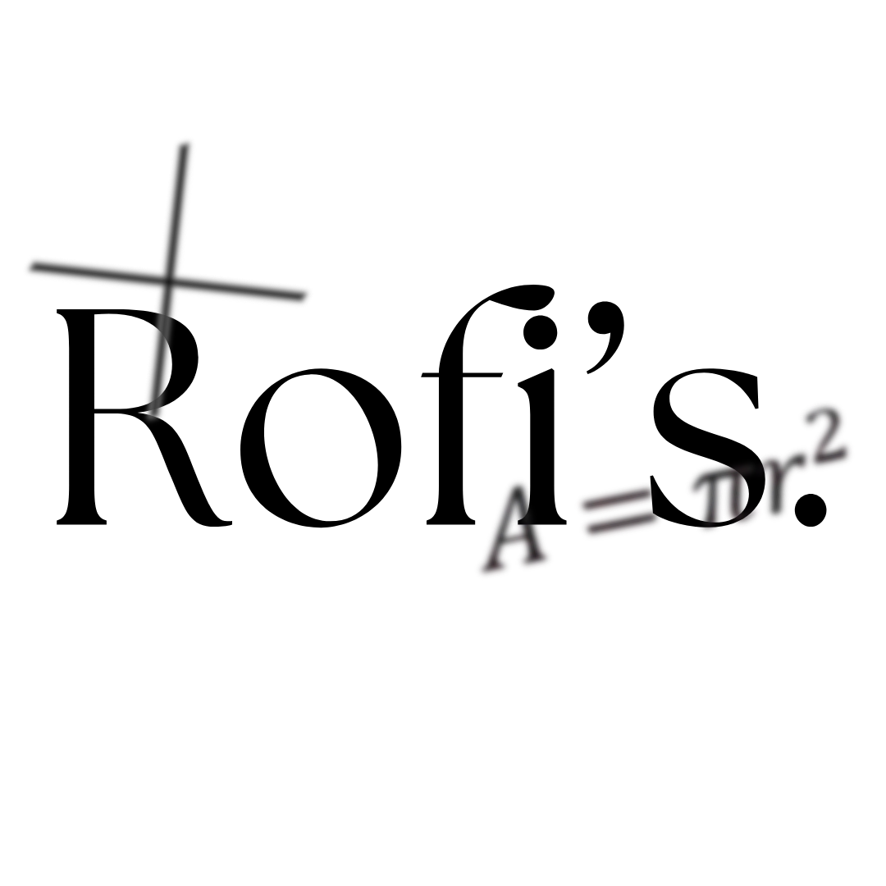

# Rofi's Mathlab

<p align="center">
  
</p>

<p align="center">
  A comprehensive interactive mathematics learning platform with step-by-step solutions and visual explanations
</p>

## 🚀 Features

- **Interactive Learning Paths**: Structured courses in Algebra, Geometry, Calculus, and more
- **Formula Reference**: Comprehensive collection of mathematical formulas with detailed explanations
- **Practice Exercises**: Targeted skill-building with immediate feedback
- **Step-by-Step Solutions**: Visual explanation of solving processes
- **20+ Mathematical Apps**: Interactive tools for exploration and visualization:
  - Dynamic Graphing Calculator
  - Interactive Derivative Explorer
  - 3D Vector Visualizer
  - Matrix Playground
  - Probability Simulator
  - Fractal Generator
  - And many more!

## 🖥️ Technologies Used

- **React**: Frontend framework
- **TypeScript**: Type-safe JavaScript
- **Tailwind CSS**: Utility-first CSS framework
- **KaTeX**: Mathematical expression rendering
- **MathJS**: Mathematical computations
- **Algebrite**: Symbolic mathematics library
- **Plotly.js**: Interactive graphing
- **Lucide React**: Modern icon library

## 🛠️ Getting Started

### Prerequisites

- Node.js 18 or higher
- npm or yarn

### Installation

1. Clone the repository
   ```bash
   git clone https://github.com/yourusername/rofis-mathlab.git
   cd rofis-mathlab
   ```

2. Install dependencies
   ```bash
   npm install
   # or
   yarn
   ```

3. Start the development server
   ```bash
   npm run dev
   # or
   yarn dev
   ```

4. Open your browser and navigate to `http://localhost:5173`

## 📖 Project Structure

```
src/
├── components/     # UI components
│   ├── apps/       # Interactive mathematical applications
│   └── ...         
├── data/           # Static data and mathematical content
├── hooks/          # Custom React hooks
├── types/          # TypeScript type definitions
├── utils/          # Utility functions and mathematical engines
├── App.tsx         # Main application component
└── main.tsx        # Entry point
```

## 🧮 Mathematical Apps

Rofi's Mathlab includes 20 interactive mathematical applications:

1. **Dynamic Graphing Calculator**: Plot and explore 2D and 3D functions
2. **Equation Step Solver**: Visual step-by-step equation solving
3. **Interactive Derivative Explorer**: Real-time visualization of derivatives
4. **3D Vector Visualizer**: Explore vector operations in 3D space
5. **Probability Simulator**: Interactive simulations of probability concepts
6. **Matrix Playground**: Operations and transformations with matrices
7. **Differential Equation Visualizer**: Explore differential equations graphically
8. **Fourier Series Sound Tool**: Visualize and hear Fourier series decomposition
9. **Math Word Problem Converter**: Convert word problems to mathematical notation
10. **Function Composition Visualizer**: Interactive function composition exploration
11. **Limit & Continuity Visual Lab**: Interactive epsilon-delta visualization
12. **Interactive Trigonometry Triangle**: Draggable triangle with real-time calculations
13. **Linear Transformation on Shapes**: Visualize matrix transformations
14. **Set Theory Venn Diagram Tool**: Interactive set operations
15. **Algebraic Expression Simplifier Game**: Gamified expression simplification
16. **Fractal Generator**: Create beautiful fractal patterns
17. **Prime Number Explorer**: Visualize prime numbers and explore factorization
18. **Math Puzzle Generator**: Procedurally generated math puzzles
19. **Dynamic Inequality Grapher**: Systems of inequalities with shaded regions
20. **Live Coding Math Notebook**: Interactive mathematical notebook

## 📝 Usage

The application is organized into several main sections:

### Dashboard
The landing page provides access to all features and tracks your learning progress.

### Learning Paths
Structured courses on different mathematical topics with interactive lessons.

### Formula Reference
A comprehensive collection of mathematical formulas with examples and explanations.

### Practice Exercises
Targeted problem-solving with instant feedback and explanations.

### Mathematical Apps
Interactive tools for exploring various mathematical concepts.

## 👥 Contributing

Contributions are welcome! Please feel free to submit a Pull Request.

1. Fork the repository
2. Create your feature branch (`git checkout -b feature/amazing-feature`)
3. Commit your changes (`git commit -m 'Add some amazing feature'`)
4. Push to the branch (`git push origin feature/amazing-feature`)
5. Open a Pull Request

## 📜 License

This project is licensed under the MIT License - see the [LICENSE](LICENSE) file for details.

## 🙏 Acknowledgements

- [KaTeX](https://katex.org/) - The fastest math typesetting library for the web
- [MathJS](https://mathjs.org/) - An extensive math library for JavaScript
- [Plotly.js](https://plotly.com/javascript/) - Scientific graphing library
- [Algebrite](http://algebrite.org/) - Computer Algebra System in JavaScript

## 📧 Contact

Your Name - [your.email@example.com](mailto:your.email@example.com)

Project Link: [https://github.com/yourusername/rofis-mathlab](https://github.com/yourusername/rofis-mathlab)

---

<p align="center">Made with ❤️ for mathematics education</p>